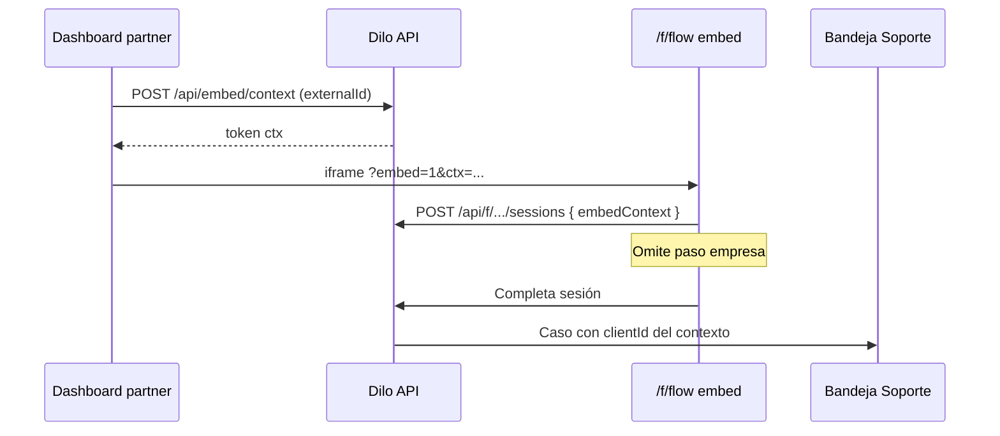

# Clientes y embed contextual

Módulo para empresas que atienden **muchas empresas** (B2B2B) y embeben Dilo en su propio dashboard (burbuja o iframe).

## Problema que resuelve

| Antes | Ahora |
|-------|-------|
| Alta manual cliente por cliente | CRUD completo + **import CSV** |
| Select con 100 empresas en el form | **Contexto embed**: la plataforma anfitriona indica la empresa |
| Usuario final elige entre otras empresas | Paso `empresa` se **omite** si hay contexto |
| Un solo embed genérico | Snippet por cliente o **token dinámico** por sesión |

## Modelo de datos (`clients`)

Entidad canónica por workspace. Campos pensados para LATAM (no solo Colombia):

| Campo | Uso |
|-------|-----|
| `name` | Nombre comercial (obligatorio) |
| `legal_name` | Razón social |
| `external_id` | ID en el sistema del partner (tenant). Único por org |
| `tax_id_type` | `nit_co`, `ruc_pe`, `rfc_mx`, `rut_cl`, `cuit_ar`, `ruc_ec`, `rif_ve`, `rtn_hn`, `cedula_juridica_cr`, `generic` |
| `tax_id` | Número de documento fiscal |
| `email`, `phone`, `website` | Contacto |
| `address_line1`, `address_line2`, `city`, `state_region`, `postal_code`, `country_code` | Dirección (ISO 3166-1 alpha-2 en país) |
| `notes` | Notas internas |
| `status` | `active` \| `inactive` |
| `embed_allowed_domains` | Lista JSON de dominios permitidos (futuro endurecimiento) |
| `slug` | Identificador interno único por org |

## Menú

| Ruta | Descripción |
|------|-------------|
| **Clientes** | `/dashboard/clients` — directorio, plantilla Excel, carga masiva |
| **Conexiones** | `/dashboard/settings/connections/embed` — widget embebido (UI guiada) |
| **Soporte** | Casos e informes (agrupados por cliente) |

## Importación Excel (no CSV)

1. En **Clientes**, clic en **Descargar plantilla Excel** (`GET /api/clients/import/template`).
2. Rellena la hoja **Clientes** (columnas en español + fila de ejemplo).
3. **Cargar plantilla** → `POST /api/clients/import` (multipart `.xlsx`).

Columnas principales: `nombre_comercial`, `razon_social`, `id_en_tu_sistema`, `tipo_documento`, `numero_documento`, contacto y dirección. Ver hoja **Instrucciones** en el archivo.

## Embed contextual (Configuración → Conexiones)

UI en **`/dashboard/settings/connections/embed`**: elige flow, modo burbuja o bloque, copia el código y ve la vista previa. Explicación paso a paso para usuarios no técnicos.

Técnicamente (opcional, colapsado en la UI):

### Escenario A — Un dashboard, muchos tenants (recomendado)

ProTiempo tiene **un** dashboard. Cada usuario logueado pertenece a **una** empresa. Al abrir la burbuja de soporte, el backend de ProTiempo sabe el tenant y pasa el contexto a Dilo **sin preguntar empresa**.

### Escenario B — Snippet fijo por cliente

Cada portal/cliente tiene su propio iframe con `data-client` o `data-external-id`.

### Modos de pasar contexto

1. **Token firmado (producción)**  
   Backend del partner → `POST /api/embed/context` con `clientId` o `externalId` + `flowId`.  
   Respuesta: `{ token, expiresAt }`.  
   Iframe: `/f/{flowId}?embed=1&ctx={token}`

2. **Parámetro directo (MVP / desarrollo)**  
   `/f/{flowId}?embed=1&client={uuid}` — validado contra el org del flow.

3. **API JS del widget**  
   `window.DiloEmbed.setContext({ clientId | externalId })` recarga el iframe con contexto.

### Snippet estático por cliente

```html
<script
  src="https://getdilo.io/embed.js"
  data-flow="FLOW_UUID"
  data-client="CLIENT_UUID"
  data-height="640px"
></script>
```

Con ID externo del partner:

```html
<script
  src="https://getdilo.io/embed.js"
  data-flow="FLOW_UUID"
  data-external-id="tenant_4821"
></script>
```

### Burbuja flotante

```html
<script
  src="https://getdilo.io/embed.js"
  data-flow="FLOW_UUID"
  data-mode="bubble"
  data-label="¿Necesitas ayuda?"
></script>
```

Al abrir, el padre debe llamar `DiloEmbed.setContext({ externalId: currentTenantId })` si el tenant cambia en runtime.

### Sesión y casos de soporte

- Al crear sesión pública se guarda `metadata.embedContext.clientId`.
- Pasos con variable `empresa`, `company`, `compania`, etc. se **saltan** si hay contexto.
- Al completar, `createSupportCaseFromSession` usa ese `clientId` aunque no haya respuesta de empresa.

## Import CSV

Reemplazado por **plantilla Excel** — ver sección Importación Excel arriba.

<!--
Columnas legacy CSV:

```
name, legal_name, external_id, tax_id_type, tax_id, email, phone, website,
address_line1, address_line2, city, state_region, postal_code, country_code, notes
```

- `name` obligatorio por fila.
- Duplicados por `external_id` o `name` → actualiza (upsert) si `updateExisting: true`.
-->

<!--

## API

| Método | Ruta | Descripción |
|--------|------|-------------|
| GET | `/api/clients` | Lista |
| POST | `/api/clients` | Crear |
| GET | `/api/clients/:id` | Detalle |
| PATCH | `/api/clients/:id` | Editar |
| DELETE | `/api/clients/:id` | Borrar (soft: status inactive si tiene casos) |
| POST | `/api/clients/import` | Import CSV |
| POST | `/api/embed/context` | Token firmado (owner/admin) |

## Variables de entorno

- `DILO_EMBED_CONTEXT_SECRET` — firma de tokens embed (opcional; fallback `DILO_INTEGRATION_SECRETS_KEY`).

## Roadmap (no incluido en esta entrega)

- **Deflexión con IA / wiki** antes de crear caso (`support_case_policy: on_escalation_only`).
- Validación estricta de `Referer` vs `embed_allowed_domains`.
- Webhook al partner cuando se crea caso con `external_id`.

## Flujo técnico resumido


